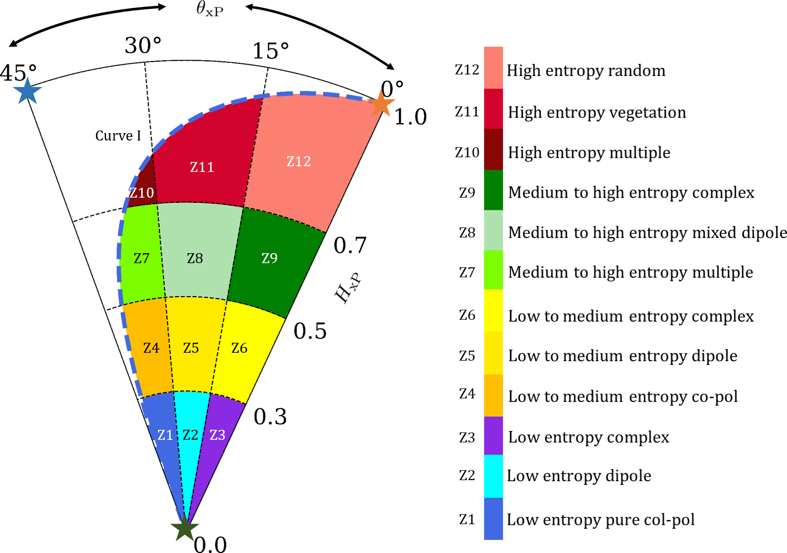

#  and  clustering for dual polarimetric SAR data (HH-HV or, VV-VH)

This repository helps to make cluster using the target characterozation parameter,  and the scattering entropy,  information. The clustering plane and its feasible region are shown in the Figure 1.

  
<em align="center">Figure 1. Clustering plane using  and . Shaded region in black colour is non feasible. The two bounding curves are denoted as "curve I" and "curve II".</em>

The names and colours of zones are given in Figure 2.

  
<em align="center">Figure 2. Clustering zones and their names. It should be noted that for most of the natural targets  varies from  to . Hence, the clustering zones are shown within this range.</em>

# Up and Run

Requirements:

1. Python 3
2. Gdal, numpy, matplotlib
3. Dual pol SAR data (HH--HV or, VV--VH) in C2 format

a. Run the `theta_xP.py` file to generate  image.
b. Use `PolSARpro` software to compute the entropy image
c. Rename the entropy image to `H_xP.bin'
d. 
